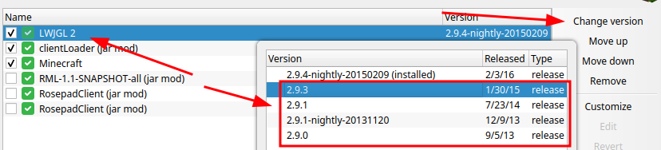

# Installing Rosepad into MultiMC

1. Create a new instance with version `a1.1.0` (you might need to check "Alphas" checkbox)
2. Open instance editor
3. In "Version" tab, click "Replace Minecraft.jar" and find Rosepad jar in the opened prompt
4. Downgrade LWJGL to 2.9.1

5. In "Settings" tab set "Java installation" to the [Java 8 Home](https://www.theserverside.com/definition/JAVA_HOME)
6. Add `-Djava.util.Arrays.useLegacyMergeSort=true` JVM argument
7. Launch the game
